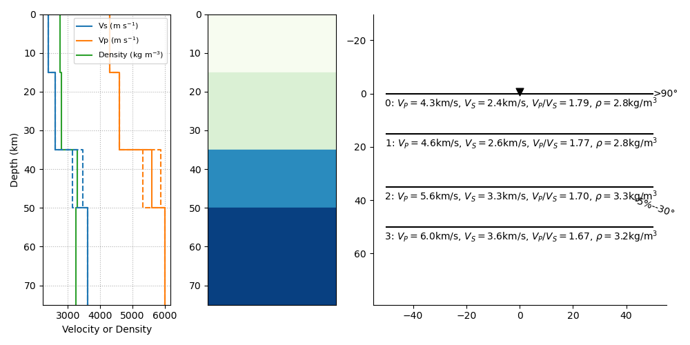
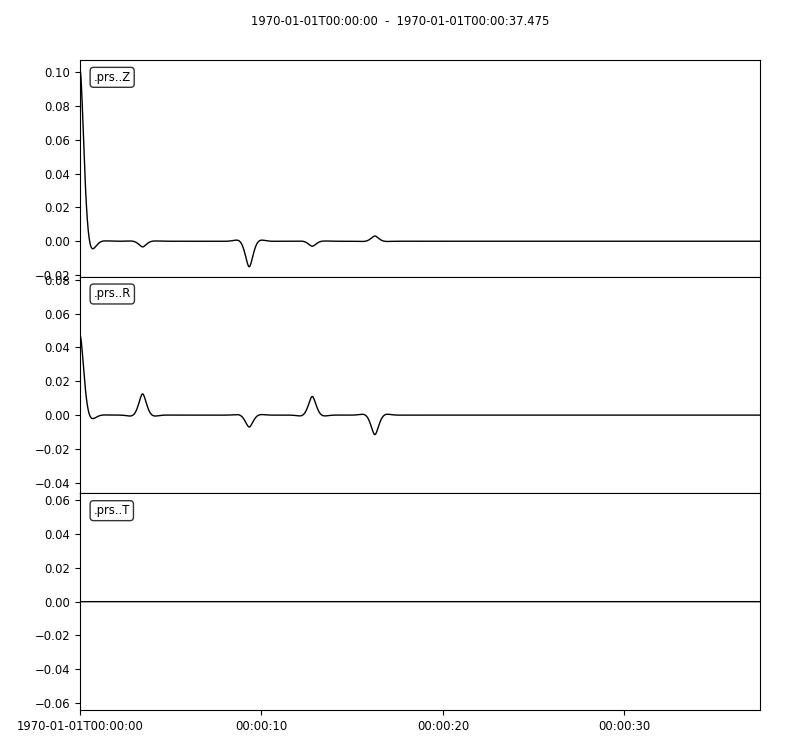
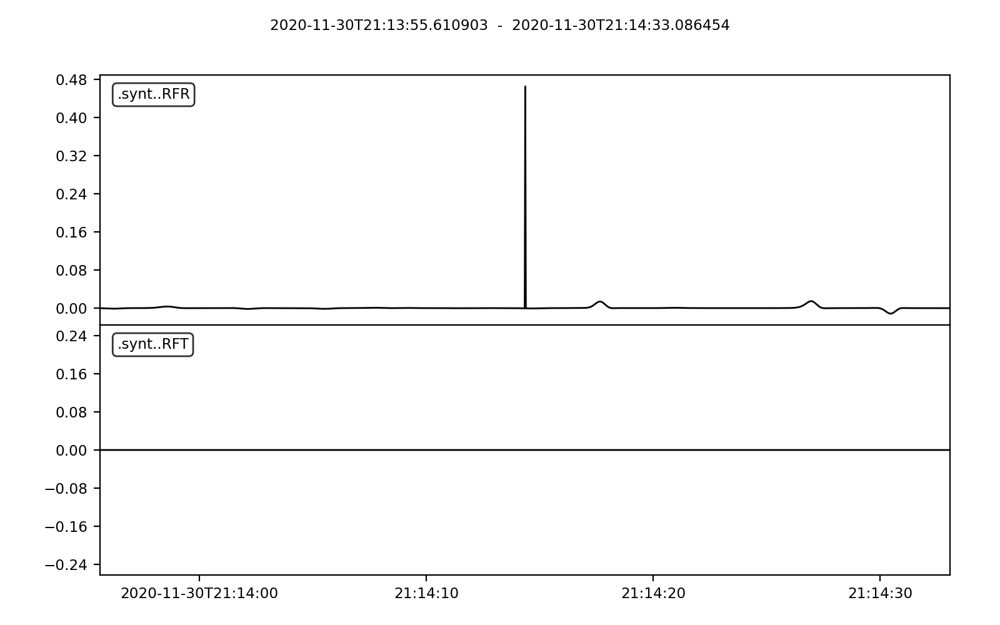

.. figure:: ../pyraysum/examples/picture/PyRaysum_logo.png
   :align: center

Licence
-------

Copyright 2020 Pascal Audet

Permission is hereby granted, free of charge, to any person obtaining a copy
of this software and associated documentation files (the "Software"), to deal
in the Software without restriction, including without limitation the rights
to use, copy, modify, merge, publish, distribute, sublicense, and/or sell
copies of the Software, and to permit persons to whom the Software is
furnished to do so, subject to the following conditions:

The above copyright notice and this permission notice shall be included in all
copies or substantial portions of the Software.

THE SOFTWARE IS PROVIDED "AS IS", WITHOUT WARRANTY OF ANY KIND, EXPRESS OR
IMPLIED, INCLUDING BUT NOT LIMITED TO THE WARRANTIES OF MERCHANTABILITY,
FITNESS FOR A PARTICULAR PURPOSE AND NONINFRINGEMENT. IN NO EVENT SHALL THE
AUTHORS OR COPYRIGHT HOLDERS BE LIABLE FOR ANY CLAIM, DAMAGES OR OTHER
LIABILITY, WHETHER IN AN ACTION OF CONTRACT, TORT OR OTHERWISE, ARISING FROM,
OUT OF OR IN CONNECTION WITH THE SOFTWARE OR THE USE OR OTHER DEALINGS IN THE
SOFTWARE.

Installation
------------

Dependencies
++++++++++++

``PyRaysum`` requires a modern Fortran compiler (e.g., `gfortran <https://gcc.gnu.org/wiki/GFortran>`_, ifort). In addition, the following packages are required:

- `pandas <https://pandas.pydata.org>`_
- `obspy <https://github.com/obspy/obspy/wiki>`_

By  default, both ``numpy`` and ``matplotlib`` are installed as dependencies
of ``obspy``.

.. warning::
    There appears to be an issue when installing `obspy==1.2.2` with `numpy=1.22.2`. 
    If you run into `AttributeError: 'numpy.int64' object has no attribute 'split'`,
    you can downgrade to `numpy=1.21.5` with `conda install numpy=1.21.5` within the
    conda environment (see below).

Conda environment
+++++++++++++++++

We recommend creating a custom
`conda environment <https://conda.io/docs/user-guide/tasks/manage-environments.html>`_
where ``pyraysum`` can be installed along with its dependencies:

.. sourcecode:: bash

   conda create -n prs python=3.8 fortran-compiler obspy pandas -c conda-forge

Activate the newly created environment:

.. sourcecode:: bash

   conda activate prs

Installing latest version from PyPi
+++++++++++++++++++++++++++++++++++

*This option is not available at this time*

Installing development version from source
++++++++++++++++++++++++++++++++++++++++++

- Clone the repository:

.. sourcecode:: bash

   git clone https://github.com/paudetseis/PyRaysum.git
   cd PyRaysum

- Install using ``pip``:

.. sourcecode:: bash

   pip install .

Testing
+++++++

``pyraysum`` is bundled with unit tests that can be run once the software is installed. 

- Install ``pytest``

.. sourcecode:: bash

   conda install pytest

- Run the tests

.. sourcecode:: bash

   mkdir empty
   cd empty
   pytest -v ../pyraysum/tests/

Usage
-----

Jupyter Notebooks
+++++++++++++++++

Included in this package is a set of Jupyter Notebooks (see Table of Content),
which give examples on how to call the various routines and obtain plane wave
seismograms and receiver functions.
The Notebooks describe how to reproduce published examples of synthetic data
from `Porter et al. (2011) <https://doi.org/10.1130/L126.1>`_.

After ``pyraysum`` is installed, these notebooks can be locally installed
(i.e., in a local folder ``Notebooks``) from the package
by typing in a ``python`` window:

.. sourcecode :: python

   from pyraysum import doc
   doc.install_doc(path='Notebooks')

To run the notebooks you will have to further install ``jupyter``.
From the terminal, type:

.. sourcecode :: bash

   conda install jupyter

Followed by:

.. sourcecode :: bash

   cd Notebooks
   jupyter notebook

You can then save the notebooks as ``python`` scripts,
check out the model files and set up your own examples.

Seismic velocity models
+++++++++++++++++++++++

Loading a model file
~~~~~~~~~~~~~~~~~~~~

In the Jupiter notebooks you will find a folder named ``models`` where a
few examples are provided. The header of the file ``model_Porter2011_dip.txt``
looks like:

.. sourcecode:: bash

    ################################################
    #
    #   Model file to use with `telewavesim` for
    #   modeling teleseismic body wave propagation
    #   through stratified media.
    #
    #   Lines starting with '#' are ignored. Each
    #   line corresponds to a unique layer. The
    #   bottom layer is assumed to be a half-space
    #   (Thickness is irrelevant).
    #
    #   Format:
    #       Column  Contents
    #          0    Thickness (m)
    #          1    Density (kg/m^3)
    #          2    Layer P-wave velocity (m/s)
    #          3    Layer S-wave velocity (m/s)
    #          4    Layer flag
    #                   1: isotropic
    #                   0: transverse isotropy
    #          5    % Transverse anisotropy (if Layer flag is set to 0)
    #                   0: isotropic
    #                   +: fast symmetry axis
    #                   -: slow symmetry axis
    #          6    Trend of symmetry axis (degrees)
    #          7    Plunge of symmetry axis (degrees)
    #          8    Interface strike (degrees)
    #          9    Interface dip (degrees)
    #
    ################################################

The header is not required and can be deleted when you become familiar
with the various definitions. Note that the code requires 10 entries per
layer, regardless of whether or not the variable is required (it will
simply be ignored if it's not).

Let us break down each line, depending on how you set ``Layer flag``:

Layer flag set to ``1``
*************************

This flag represents a case where the layer is isotropic.

- Set column 0 (``Thickness``), column 1 (``Density``), column 2 (``P-wave velocity``), column 3 (``S-wave velocity``) and column 4 (as ``iso``)

- Set columns 5 to 7 to ``0.`` or any other numerical value - they will be ignored by the software.

- Set columns 8 and 9 to the strike and dip angles of the layer in degrees (0. by default)

Layer flag set to ``0``
*************************

This flag represents a transversely isotropic layer. We adhere with
the definition in
`Porter et al. (2011) <https://doi.org/10.1130/L126.1>`_,
whereby the parameter :math:`\eta`, which describes the curvature of the
velocity “ellipsoid” between the :math:`V_P`-fast and :math:`V_P`-slow axes, varies
with anisotropy for a 2-:math:`\psi` model and is not fixed.

The column 5 in this case sets the percent anisotropy for both
:math:`V_P` and :math:`V_S` (equal anisotropy for both :math:`V_P` and :math:`V_S`) and is the only
instance where this column is required.

- Set all columns to the required numerical value (and column 4 to ``1``)

Creating a ``Model`` class instance
~~~~~~~~~~~~~~~~~~~~~~~~~~~~~~~~~~~

Models can also be defined on the fly in Python using lists that contain
the relevant information as input into an instance of the
:class:`~pyraysum.prs.Model` class.

Examples
********

.. sourcecode:: python

   >>> from pyraysum import Model

- Define a two-layer model with isotropic properties and no dip

.. sourcecode:: python

   >>> thick = [20000., 0.]       # Second layer thickness is irrelevant
   >>> rho = [2800., 3300.]
   >>> vp = [4600., 6000.]
   >>> vs = [2600., 3600.]
   >>> model = Model(thick, rho, vp, vs)

- Define a two-layer model with transversely isotropic crust over isotropic half-space

.. sourcecode:: python

   >>> # Example using a single line
   >>> model = Model([20000., 0.], [2800., 3300.], [4000., 6000.], [2600., 3600.], [0, 1], [5., 0], [30., 0], [10., 0], [0., 0.], [0., 0.])

.. note::

   In this example all entries for the first layer are required. Here the anisotropy is
   set to 5% (i.e., fast axis of symmetry; for slow axis the user should input ``-5.``)
   and the axis of symmetry has a trend of 30 degrees and a plunge of 10 degrees.

Plotting a model
~~~~~~~~~~~~~~~~

When a :class:`~pyraysum.prs.Model` is created (from either method detailed above), the ``model`` instance has methods to generate plots of the seismic velocity model that it contains. The simplest option is to use the ``plot()`` method, which will produce a figure with two subplots: 1) a stair-case plot of the seismic velocity and density profiles, and 2) a layered (stratigraphic-like) representation of the model. These subplots can be created separately using the ``plot_profile()`` and ``plot_layers()`` methods directly.

Example
*******

.. sourcecode:: python

   >>> from pyraysum import Model

- Define a four-layer model with a mix of isotropic and transverse isotopic properties. 

.. note::

	Note here we do not specify the trend and plunge of the symmetry axis since this information is not (yet) used in the plot. Default values will apply (``0.`` for both parameters).

.. sourcecode:: python

   >>> thick = [15000., 20000., 15000.,  0.]
   >>> rho = [2750.,  2800., 3300., 3250.]
   >>> vp = [4300., 4600., 5600., 6000.]
   >>> vs = [2400., 2600., 3300., 3600.]
   >>> isoflg = [1, 1, 0, 1]
   >>> ani = [0., 0., 5., 0.]
   >>> model = Model(thick, rho, vp, vs, isoflg=isoflg, ani=ani)

   >>> model.plot()

Basic usage
+++++++++++

These examples are extracted from the :func:`~pyraysum.prs.run_prs` function.

For anisotropic velocity models, users need to specify the back-azimuth
value in degrees. Furthermore, the default type of the incoming
teleseismic body wave is ``'P'`` for compressional wave. Other options are
``'SV'`` or ``'SH'`` for vertically-polarized shear wave or
horizontally-polarized shear wave, respectively.
Wave modes cannot be mixed.

Modeling a single event
~~~~~~~~~~~~~~~~~~~~~~~

.. sourcecode:: python

   >>> from pyraysum import prs, Model, Geometry
   >>> # Define two-layer model with isotropic crust over isotropic half-space
   >>> model = Model([30000., 0], [2800., 3300.], [6000., 8000.], [3600., 4500.])
   >>> geom = Geometry(0., 0.06) # baz = 0 deg; slow = 0.06 x/km
   >>> npts = 1500
   >>> dt = 0.025      # s
   >>> streamlist = prs.run_frs(model, geom, npts=npts, dt=dt)

   >>> type(streamlist[0])
   <class 'obspy.core.stream.Stream'>
   >>> print(st)
   3 Trace(s) in Stream:
   3 Trace(s) in Stream:
   .synt..BHN | 2020-11-30T21:04:43.890339Z - 2020-11-30T21:05:21.365339Z | 40.0 Hz, 1500 samples
   .synt..BHE | 2020-11-30T21:04:43.891418Z - 2020-11-30T21:05:21.366418Z | 40.0 Hz, 1500 samples
   .synt..BHZ | 2020-11-30T21:04:43.891692Z - 2020-11-30T21:05:21.366692Z | 40.0 Hz, 1500 samples   >>> st.plot(size=(600, 450))

Filter streams using a lowpass filter and plot using the ``obspy`` function.

.. sourcecode:: python

   >>> streamlist.filter('streams', 'lowpass', freq=1., corners=2, zerophase=True)
   >>> streamlist.streams[0].plot()

Modeling receiver functions
~~~~~~~~~~~~~~~~~~~~~~~~~~~

Receiver functions can only be calculated for component rotation equals to '1' (R-T-Z system)
or '2' (P-SV-SH system). There are two ways to calculate receiver functions - either directly
from the function ``run_prs`` with the argument ``rf=True`` (default is False), or after
you have obtained the 3-component seismograms from ``run_prs`` with ``rot=1`` or ``rot=2``.

Let's first define a simple 2-layer model:

.. sourcecode:: python

   >>> from pyraysum import prs, Model, Geometry
   >>> # Define two-layer model with isotropic crust over isotropic half-space
   >>> model = Model([30000., 0], [2800., 3300.], [6000., 8000.], [3600., 4500.])
   >>> geom = Geometry(0., 0.06) # baz = 0 deg; slow = 0.06 x/km
   >>> npts = 1500
   >>> dt = 0.025      # s

Method 1
********

.. sourcecode:: python

   >>> streamlist = prs.run_frs(model, geom, npts=npts, dt=dt, rot=1, rf=True)
   
   >>> print(streamlist.rfs[0])
   2 Trace(s) in Stream:
   .synt..RFR | 2020-12-12T21:43:39.788002Z - 2020-12-12T21:44:17.263002Z | 40.0 Hz, 1500 samples
   .synt..RFT | 2020-12-12T21:43:39.788682Z - 2020-12-12T21:44:17.263682Z | 40.0 Hz, 1500 samples

   >>> streamlist.filter('rfs', 'lowpass', freq=1., corners=2, zerophase=True)
   >>> streamlist.rfs[0].plot()

Method 2
********

.. sourcecode:: python

   >>> streamlist = prs.run_frs(model, geom, npts=npts, dt=dt, rot=1)
   >>> rflist = streamlist.calculate_rfs()

   >>> print(rflist[0])
   2 Trace(s) in Stream:
   .synt..RFR | 2020-12-12T21:44:13.539484Z - 2020-12-12T21:44:51.014484Z | 40.0 Hz, 1500 samples
   .synt..RFT | 2020-12-12T21:44:13.540241Z - 2020-12-12T21:44:51.015241Z | 40.0 Hz, 1500 samples

   >>> [rf.filter('lowpass', freq=1., corners=2, zerophase=True) for rf in rflist]
   >>> rflist[0].plot()

Both methods will produce the same receiver function figure. Note that the zero lag time at the center of the time axis. You can also notice wrap-around effects (weak arrivals before zero-lag time). Be careful when selecting time-sampling parameters when running ``Raysum``.

