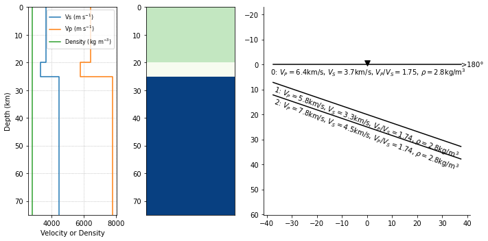
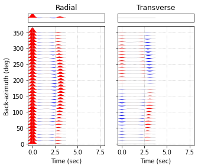
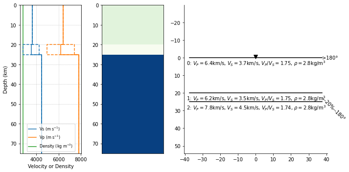
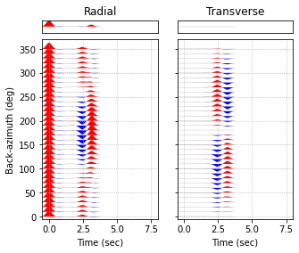
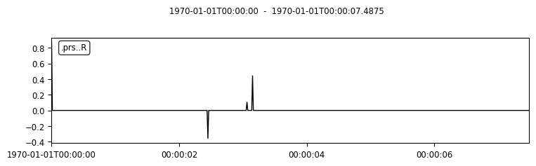

Example 2: Reproducing Receiver Functions for Dipping and Anisotropic Subsurface Structure
==========================================================================================

In this example we generate *P* receiver functions for a model that
includes either a dipping lower crustal layer or a lower-crustal
anisotropic layer. These example reproduce the results of Figure 3 in
`Porter et al. (2011) <#references>`__.

Start by importing the necessary packages:

.. code:: ipython3

    from pyraysum import prs, Geometry, Model, RC
    import numpy as np

Dipping Layers
--------------

Define the arrays of slowness and back-azimuth values of the incident
``P`` wave to use as input in the simulation

.. code:: ipython3

    baz = np.arange(0., 360., 10.)
    slow = 0.06
    geom = Geometry(baz, slow)
    _ = geom.plot()

.. image:: output_3_0.png

Define the model object. The values used are found in the caption of
Figure 3. Note that :math:`V_S` can be parameterized either directly or
as :math:`V_P/V_S`, which is what we do here. Also note that values that
are constant for all layers can be given as floats.

.. code:: ipython3

    thickn = [20000, 5000, 0]
    rho = 2800
    vp = [6400, 5800, 7800]
    vpvs = [1.75, 1.74, 1.74]
    dip = [0, 20, 20]
    strike = 90
    
    model = Model(thickn, rho, vp, vpvs=vpvs, strike=strike, dip=dip)
    model.plot()
    print(model)

.. parsed-literal::

    # thickn     rho      vp      vs  flag aniso   trend plunge strike   dip
     20000.0  2800.0  6400.0  3657.1    1    0.0     0.0    0.0   90.0   0.0
      5000.0  2800.0  5800.0  3333.3    1    0.0     0.0    0.0   90.0  20.0
         0.0  2800.0  7800.0  4482.8    1    0.0     0.0    0.0   90.0  20.0
    

Here we specify the argument ``rot=1`` to produce seismograms aligned in
the ``R-T-Z`` coordinate system. The default value is ``rot=0``, which
produces seismograms aligned in the ``N-E-Z`` coordinate system that
**should not** be used to calculate receiver functions. Furthermore, we
are interested only in the direct conversions, and therefore specify
``mults=0`` to avoid dealing with multiples. This is required to
reproduce the published examples, although it is good practice to keep
all first-order multiples to properly simulate all possible phase
arrivals.

.. code:: ipython3

    rc = RC(rot=1, mults=0, verbose=False, npts=600, dt=0.0125)

Now, let’s run the simulation. All book-keeping is handled internally.

.. code:: ipython3

    seismogram = prs.run(model, geom, rc)

The function returns a ``Seismogram`` object whose attributes are the
``Model``, ``Geometry`` of incoming rays, a list of ``Streams`` as well
as all run-time arguments that are used by Raysum:

.. code:: ipython3

    seismogram.__dict__.keys()

.. parsed-literal::

    dict_keys(['model', 'geom', 'streams', 'rc'])

We can then use the method ``calculate_rfs()`` to calculate receiver
functions.

.. code:: ipython3

    seismogram.calculate_rfs()

The receiver functions are stored as an additional attribute of the
streamlist object, which is itself a list of ``Streams`` containing the
radial and transverse component RFs:

.. code:: ipython3

    seismogram.__dict__.keys()

.. parsed-literal::

    dict_keys(['model', 'geom', 'streams', 'rc', 'rfs'])

We can now filter and plot the results - we specify the key ``'rfs'`` to
work on the receiver functions only.

.. code:: ipython3

    seismogram.filter('rfs', 'lowpass', freq=1., zerophase=True, corners=2)
    seismogram.plot('rfs', tmin=-0.5, tmax=8.)

Anisotropic Layers
------------------

Now let’s reproduce the second case with the anisotropic lower crustal
layer. Here, the second layer (``1`` in python indexing) is not dipping,
but has a strong anisotropy of -20%. The anisotropy axis trends south
(``trend = 180``) and plunges 45 degree (``plunge = 45``). The *P*-wave
velocity is 6.2 km/s. We could define a new model as above. Another
possibility is to use use a short command string to change the existing
model.

Note that when we change the *P* wave velocity and want to maintain a
constant :math:`V_P/V_S` ratio, we must explicitly change ``vpvs`` by
changing ``vs``. This is archived using the ``'pss'`` attribute
indicator below.

.. code:: ipython3

    model.change('d1=0; d2=0; vp1=6.2; pss1=1.75; a1=-20; tr1=180; pl1=45;')
    model.plot()
    print(model)

.. parsed-literal::

    Changed: dip[1] = 0.0
    Changed: dip[2] = 0.0
    Changed: vp[1] = 6200.0
    Changed: vpvs[1] = 1.75
    Changed: ani[1] = -20.0
    Changed: trend[1] = 180.0
    Changed: plunge[1] = 45.0

.. parsed-literal::

    # thickn     rho      vp      vs  flag aniso   trend plunge strike   dip
     20000.0  2800.0  6400.0  3657.1    1    0.0     0.0    0.0   90.0   0.0
      5000.0  2800.0  6200.0  3542.9    0  -20.0   180.0   45.0   90.0   0.0
         0.0  2800.0  7800.0  4482.8    1    0.0     0.0    0.0   90.0   0.0
    

Instead of two dipping interfaces, the model now has a thin anisotropic
layer at the base of the crust. We again compute synthetic seismograms
and use the ``rf`` argument to process the receiver functions as well.

.. code:: ipython3

    seismogram = prs.run(model, geom, rc, rf=True)
    
    seismogram.filter('rfs', 'lowpass', freq=1., zerophase=True, corners=2)
    seismogram.plot('rfs', tmin=-0.5, tmax=8.)

Understanding Fast and Slow S-Waves
-----------------------------------

To understand the different phases present we can look at, e.g., the
receiver function at back-azimuth 150°. We look into how the individual
phases are called and when they arrive.

The following command tells us that the negative wiggle arriving at 2.5
seconds is a P-to-S conversion at the bottom of layer 0 (i.e. the top of
the anisotropic layer), whereas the positive wiggle at 3s consists of
two S-waves arriving shortly after one another: The smaller wiggle is
the P-to-S1 conversion at the bottom of layer 1 (the anisotropic layer),
and the larger one is the P-to-S2 conversion at the same interface.
(Note that the slow S-wave is denoted *T*, to avoid ambiguity with the
layer indices.) Both phases travel as an S-wave (here again named *T*)
in the topmost layer 0, but at different speeds.

.. code:: ipython3

    print(seismogram.streams[15][0].stats.phase_descriptors)
    print(seismogram.streams[15][0].stats.phase_times)
    _ = seismogram.streams[15][0].plot()

.. parsed-literal::

    ['2P1P0P' '2P1P0S' '2P1S0S' '2P1T0S']
    [0.01250004768371582 2.4625535011291504 3.0867090225219727
     3.174315929412842]

On the transverse component, the P-to-S1 conversion has a negative
amplitude, while the P-to-S2 conversion has a larger, positive one.

.. code:: ipython3

    print(seismogram.streams[15][1].stats.phase_descriptors)
    print(seismogram.streams[15][1].stats.phase_times)
    
    _ = seismogram.streams[15][1].plot()

.. parsed-literal::

    ['2P1P0T' '2P1S0T' '2P1T0T']
    [2.4625535011291504 3.0867090225219727 3.174315929412842]

.. image:: output_25_1.png

Validation against Telewavesim Data
-----------------------------------

As in the previous example, we would now like to compare these results
with independently obtained results from *Telewavesim*. We’ll need
*NumPy* to conveniently load our Telewavesim data from file, *obspy* to
store them in a *Stream* object, and *Matplotlib* to make the comparison
plot.

.. code:: ipython3

    import obspy
    import matplotlib.pyplot as mp

.. code:: ipython3

    # Load telewavesim data
    time, twr, twt, twz = np.loadtxt("../data/telewavesim_aniso_baz150-slow006.dat", unpack=True)
    
    # Get time interval `dt` from data
    dt = time[1] - time[0]
    
    # Store into Stream, switch Z component polarity and set header
    twsd = obspy.Stream()
    for tr, channel in zip([twr, twt, twz], ["R", "T", "Z"]):
        header = {"delta": dt, "station": "tws", "channel": channel}
        trace = obspy.Trace(tr, header=header)
        twsd.append(trace)
        
    # Make simple plot
    _ = twsd.plot()

.. image:: output_28_0.png

We’ll again filter both seismograms, as Telewavesim data does not
provide a good infinite frequency approximation.

.. code:: ipython3

    # Set frequency corners in Hz
    fmin = 1./10. 
    fmax = 10
    prsd = seismogram.streams[15]
    prsd.trim(endtime = prsd[0].stats.starttime+5)
    
    # Demean and filter all data
    for dat in [twsd, prsd]:
        dat.detrend("demean")
        dat.filter("bandpass", freqmin=fmin, freqmax=fmax, zerophase=True)

We also need to align the two different datasets to the direct *P*-wave
and scale them to its amplitude on the vertical component.

.. code:: ipython3

    # Index of the maximum amplitude on the vertical component of the data
    imax = np.argmax(abs(prsd[2].data))
    
    # Cycle through both synthetic data and process them equally
    jmax = np.argmax(abs(twsd[2].data))  # maximum vertical amplitude
    dt = prsd[2].times()[imax] - twsd[2].times()[jmax] # relative time shift of maximum
    norm = prsd[2].data[imax] / twsd[2].data[jmax]  # relative amplitude of vertical maximum
    for tr in twsd:
        tr.stats.starttime += dt  # align peaks
        tr.data *= norm  # normalize
        tr.trim(prsd[0].stats.starttime, prsd[0].stats.endtime)

For a good comparison, we use the plot function from the previous
example:

.. code:: ipython3

    def plot(data, model):
        
        lws = [4, 1]  # linewidths ...
        cols = ["darkgray", "crimson"]  # colors for data and model
    
        # Subplot with 3 rows
        fig, axs = mp.subplots(
            nrows=3, ncols=1, figsize=(8, 6), tight_layout=True, sharex=True, sharey=True
        )
        
        # Cycle through components
        for ax, dat, mod in zip(axs, data, model):
            trs = [dat, mod]
            
            # Cycle through data and model
            for tr, lw, col in zip(trs, lws, cols):
                ax.plot(
                    tr.times(reftime=data[0].stats.starttime),
                    tr.data,
                    label=tr.stats.station + "." + tr.stats.channel,
                    lw=lw,
                    color=col,
                )
                # Write phase info
                if tr.stats.station == "prs":
                    dy = 0.05
                    # Cycle through phase descriptors
                    for n, (pht, phn, pha) in enumerate(
                        zip(
                            tr.stats.phase_times,
                            tr.stats.phase_names,
                            tr.stats.phase_amplitudes,
                        )
                    ):
                        ha = "center"
                        if phn == "PST":
                            ha = "right"
                        elif  phn == "PTS":
                            ha = "left"
    
                        sign = -np.sign(pha)  # absolute amplitudes are here meaningless due to applied filter
                        ax.text(pht, sign*dy, phn, va="center", ha=ha)
    
            ax.legend(frameon=False)
            ax.set_axis_off()
            
        # Only plot lowermost time axes
        ax.set_axis_on()
        ax.spines[["top", "left", "right", "bottom"]].set_visible(False)
        ax.set_yticks([])
        ax.set_xlabel("Time(s)")
    
        return fig

And run it

.. code:: ipython3

    _ = plot(twsd, prsd)

.. image:: output_36_0.png

We see that the Waveforms of *Pyraysum* (red) and *Teleweavesim* (gray)
match pretty well. The *Telewavsim* data has some additional energy at
about 0.9 seconds, which is a reflection from the top of the anisotropic
layer. This reflections has explicitly not been computed
(``RC.mults = 0``), but could using ``RC.set_phaselist()``.

Conclusion
----------

In this example we have explored the capabilities of *Pyraysum* to
compute synthetic seismograms and receiver functions for dipping or
anisotropic layers. We have compared the outcome of our simulations with
published results and, for the anisotropic example, also with synthetic
data from another numerical method. Both comparisons showed that
*Pyraysum* delivers comparable results.

References
----------

-  Audet, P., Thomson, C.J., Bostock, M.G., and Eulenfeld, T. (2019).
   Telewavesim: Python software for teleseismic body wave modeling.
   Journal of Open Source Software, 4(44), 1818,
   https://doi.org/10.21105/joss.01818

-  Porter, R., Zandt, G., & McQuarrie, N. (2011). Pervasive
   lower-crustal seismic anisotropy in Southern California: Evidence for
   underplated schists and active tectonics. Lithosphere, 3(3), 201-220.
   https://doi.org/10.1130/L126.1

-  Thomson, C.J. (1997). Modelling surface waves in anisotropic
   structures: I. Theory. Physics of the Earth and Planetary interiors,
   103, 195-206. https://doi.org/10.1016/S0031-9201(97)00033-2
