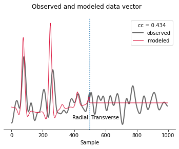
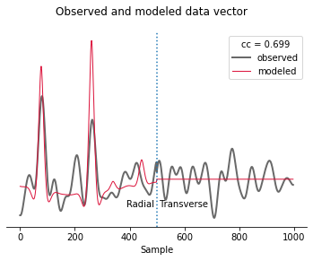

Example 3: Invert a Receiver Function
=====================================

In this example we are going to load receiver functions that have been
created from seismograms recorded at station Hyderabad, India, from 3
earthquakes that occurred in the Philippines. The source station
configuration is identical to the one in example 1. We are going to use
``pyraysum`` to generate receiver function, as in example 2. This
example explores the provisions of ``pyraysum`` for time optimized
execution. We are going to directly invoke the Fortran routine
``run_bare()`` from the ``fraysum`` module with ``python`` convenience
functions from the ``prs`` module. The inversion will be carried out by
the ``dual_annealing()`` function from ``scipy.optimize``. The filtering
and spectral division that is required to create receiver functions from
the synthetic seismograms is carried out using ``numpy`` array methods.
finally, we will plot the results with ``matplotlib``.

.. code:: ipython3

    from pyraysum import prs, frs
    from fraysum import run_bare
    import numpy as np
    import scipy.optimize as spo
    import matplotlib.pyplot as mp

Definition of the Forward Computation
-------------------------------------

We predict waveforms inside a function ``predictRF()`` that accepts
``Model``, ``Geometry``, and ``RC`` objects, which completely define the
synthetic seismograms to be computed. Only the ``fthickn`` and ``fvs``
attributes of the ``Model`` will be varied when trying different
parameter combinations. The post-processing is determined by the
bandpass filter corner frequencies ``freqs`` and the boolean time window
mask ``ist`` (“is time”). Post processing is performed on the
``numpy.ndarray`` variable ``rfarray``. Two post-processing functions
are provided. ``filtered_rf_array`` divides the SV- and SH-spectra by
the P-spectra (i.e., computes a receiver function) and filters the data,
whereas ``filtered_array`` returns the filtered SV and SH data.

.. code:: ipython3

    def predictRF(model, geometry, rc, freqs, rfarray, ist, rf=True):
    
        # Compute synthetic seismograms
        traces = run_bare(
            model.fthickn,
            model.frho,
            model.fvp,
            model.fvs,
            model.fflag,
            model.fani,
            model.ftrend,
            model.fplunge,
            model.fstrike,
            model.fdip,
            model.nlay,
            *geometry.parameters,
            *rc.parameters
        )
        
        if rf:
            # Perfrom spectral division and filtering
            frs.filtered_rf_array(
                traces, rfarray, geometry.ntr, rc.npts, rc.dt, freqs[0], freqs[1]
            )
        else:
            # Perfrom filtering only
            frs.filtered_array(
                traces, rfarray, geometry.ntr, rc.npts, rc.dt, freqs[0], freqs[1]
            )
    
        # Window traces and flatten array
        # This creates alternating radial and transverse RFs for all traces:
        # R[0] - T[0] - R[1] - T[1] ...
        prediction = rfarray[:, :, ist].reshape(-1)
    
        return prediction

Definition of the Misfit Function
---------------------------------

Here, we define the misfit function that ``dual_annealing`` will
minimize. The misfit function requires a model vector ``theta`` as first
argument. We define the first element of the model vector to be the
crustal thickness and the second one the P-to-S-wave velocity ratio.
:math:`V_P/V_S` gets projected to the S-wave velocity assuming a
constant P-wave velocity. After that, we define the misfit ``cost``
between the predicted and observed receiver functions (``pred`` and
``obs``, respectively) as 1. minus the cross correlation coefficient. A
status message is printed so the user can follow the inversion process.

.. code:: ipython3

    def misfit(theta, model, geometry, rc, freqs, rfarray, ist, obs):
    
        # Set parameters to model object
        model.fthickn[0] = theta[0]
        model.fvs[0] = model.fvp[0] / theta[1]
    
        # predict receiver functions
        pred = predictRF(model, geometry, rc, freqs, rfarray, ist)
    
        # Calculate cross correlation cost function
        cost = 1.0 - np.corrcoef(obs, pred)[0][1]
    
        msg = "h ={: 5.0f}, vpvs ={: 5.3f}, cc ={: 5.3f}".format(
            theta[0], theta[1], 1. - cost
        )
        
        print(msg)
    
        return cost

Plotting Function for Data vs. Model Prediction
-----------------------------------------------

This plot function allows us to compare the observed and predicted data
vectors:

.. code:: ipython3

    def plot(obs, pred):
        fig, ax = mp.subplots(nrows=1, ncols=1)
        fig.suptitle("Observed and modeled data vector")
        
        imid = len(obs)//2
        cc = np.corrcoef(obs, pred)[0][1]
        title = "cc = {:.3f}".format(cc)
        
        ax.plot(obs, color="dimgray", linewidth=2, label="observed")
        ax.plot(pred, color="crimson", linewidth=1, label="modeled")
        ax.text(imid, min(pred), 'Radial ', ha='right')
        ax.text(imid, min(pred), ' Transverse', ha='left')
        ax.axvline(imid, ls=':')
        ax.legend(title=title)
        ax.spines[["top", "left", "right"]].set_visible(False)
        ax.set_yticks([])
        ax.set_xlabel("Sample")

Inversion Workflow
------------------

Recording Geometry
~~~~~~~~~~~~~~~~~~

Now it is time to run the workflow. We define the back-azimuth and
slowness of seismic rays arriving at Hyderabad from the Philippines. The
time window should span the interval between 0 and 25 seconds after the
arrival of the direct P-wave. Data should be bandpassed filtered between
periods of 20 and 2 seconds.

.. code:: ipython3

    if __name__ == "__main__":
        baz = 90
        slow = 0.06
    
        twind = (0, 25)  # seconds time window
        freqs = (1 / 20, 1 / 2)  # Hz bandpass filter

Loading a Receiver Function
~~~~~~~~~~~~~~~~~~~~~~~~~~~

We load the radial and transverse receiver functions from file. The
receiver function has been created from 3 high-quality earthquake
recordings from the Philippines. Note that ``rfr`` and ``rft`` here need
to be structured such that the arrival of the direct P-wave is located
in the middle of the array. In other words, the acausal part (earlier
than direct P) must be as long as the causal part (later than direct P).
In this way, the definition of the time window mask ``ist`` is such that
it can be reused for post-processing of the synthetic receiver
functions. The windowed receiver function are concatenated to yield the
data vector.

.. code:: ipython3

        # Load saved stream
        time, rfr, rft = np.loadtxt("../data/rf_hyb.dat", unpack=True)
        ist = (time > twind[0]) & (time < twind[1])
    
        observed = np.concatenate((rfr[ist], rft[ist]))

Setup of Starting Model and Run Control Parameters
~~~~~~~~~~~~~~~~~~~~~~~~~~~~~~~~~~~~~~~~~~~~~~~~~~

We set up the starting subsurface velocity model using Saul et
al. (2000), as well as the recording geometry.

.. code:: ipython3

        thickn = [30000, 0]
        rho = [2800, 3600]
        vp = [6400, 8100]
        vs = [3600, 4600]
    
        model = prs.Model(thickn, rho, vp, vs)
        geometry = prs.Geometry(baz, slow)    

We choose the RC parameters so that they match the processing of the
receiver functions. In the present case, the receiver functions are
rotated to the P-SV-SH ray coordinate system (``rot=2``), and the
sampling interval (``dt``) and number of samples (``npts``) are set to
match the input. The ``align=1`` option (together with ``shift=None``,
which is the default) ensures that the direct P wave is located at the
first sample. ``mults=3`` is required to pre-set the list of phases to
be computed. This is the recommended option for all time-sensitive
applications, as ``mults=2`` computes many multiples, many of which
might not be used at all.

.. code:: ipython3

        rc = prs.Control(
            verbose=False,
            rot=2,
            dt=time[1] - time[0],
            npts=len(rfr),
            align=1,
            mults=3,        
        )

Definition of a Custom Phaselist
~~~~~~~~~~~~~~~~~~~~~~~~~~~~~~~~

The phaselist is defined as a list of phase descriptors, which can be
read from a previous forward calculation (e.g. example 1). Each ray
segment is described by a number-letter pair, where the number is the
layer index and the letter the phase descriptor, where uppercase
indicates upgoing rays and lowercase downgoing rays. See the
``rc.set_phaselist`` documentation for details.

This phaselist restricts the phases to be computed to:

0. direct P (*P*)
1. P-to-S converted (*PS*)
2. P reflected at the surface to downgoing S, reflected at Moho to S
   (*PpP*)
3. P reflected at the surface to downgoing P, reflected at Moho to S
   (*PpS*)
4. P reflected at the surface to downgoing S, reflected at Moho to P
   (*PsP*)

You can try the effect of incorporating *PsS* by adding ``"1P0P0s0S"``
to the phaselist. The ``equivalent=True`` keyword implicitly adds such
*equivalent* phases.

   Note: *PpS* and *PsP* phases arrive at the same time, but only phases
   that end in *S* are directly visible on the receiver function. Phases
   ending in *P* end up on the *P* polarized trace of the synthetic
   seismogram, where they become part of the denominator of spectral
   division when computing the receiver function.)

.. code:: ipython3

        rc.set_phaselist(["1P0P", "1P0S", "1P0P0p0P", "1P0P0p0S", "1P0P0s0P"], equivalent=True)

Faster Array-Based Postprocessing
~~~~~~~~~~~~~~~~~~~~~~~~~~~~~~~~~

Swift post processing of the synthetic receiver function is done on the
``rfarray`` using numpy array methods, which is initialized here. It has
shape ``(geometry.ntr, 2, rc.npts)``.

.. code:: ipython3

        rfarray = frs.make_array(geometry, rc)

A First Look at the Observed and Predicted Data Vectors
-------------------------------------------------------

Let’s see how well the starting model predicts the data. See what
changes if you set ``rf=False``, in which case no spectral division is
performed and the model prediction is the synthetic seismogram. This
expedites the computation, but is less exact.

.. code:: ipython3

        predicted = predictRF(model, geometry, rc, freqs, rfarray, ist, rf=True)
        plot(observed, predicted)

The first half of the data vector is the radial component and the second
half is the transverse component of the receiver function. In this
example, without dip or anisotropy, energy only gets converted to the
radial, not the transverse component. The first positive wiggle is *PS*,
the second one *PpS*. Note the slight mis-alignment between observation
(gray) and prediction (red). The smaller wiggles that arrive later
result from the deconvolution of *PpP*.

Inverse Modeling with Scipy’s Optimize Module
---------------------------------------------

We now define the search bounds for dual annealing. This definition
prescribes that the first element of the model vector is the *thickness
of layer 0* and is searched in an interval of
$:raw-latex:`\pm`\ :math:`5000 m, and its second element is the *`\ V_P/V_S$
ratio of layer 0*, searched in an interval of $:raw-latex:`\pm`$0.1.

.. code:: ipython3

        bounds = [
            (model[0, "thickn"] - 5000, model[0, "thickn"] + 5000),
            (model[0, "vpvs"] - 0.1, model[0, "vpvs"] + 0.1),
        ]

Now we are ready to perform the inversion using ``scipy``\ ’s `dual
annealing <https://docs.scipy.org/doc/scipy/reference/generated/scipy.optimize.dual_annealing.html>`__
function. It seeks a minimum in the ``misfit`` function defined above.
The call is in principle interchangeable with other `global search
methods from the optimization
module <https://docs.scipy.org/doc/scipy/reference/optimize.html#global-optimization>`__.

.. code:: ipython3

        result = spo.dual_annealing(
            misfit,
            bounds,
            args=(model, geometry, rc, freqs, rfarray, ist, observed),
            maxiter=20,
            seed=42,
        )
        

.. parsed-literal::

    h = 28745, vpvs = 1.868, cc = 0.408
    h = 27107, vpvs = 1.690, cc =-0.028
    h = 32605, vpvs = 1.826, cc = 0.542
    h = 31991, vpvs = 1.826, cc = 0.645
    h = 31991, vpvs = 1.805, cc = 0.697
    h = 31991, vpvs = 1.805, cc = 0.697
    h = 31991, vpvs = 1.805, cc = 0.697
    h = 31991, vpvs = 1.805, cc = 0.697
    h = 27506, vpvs = 1.877, cc =-0.611
    h = 29815, vpvs = 1.865, cc = 0.622
    h = 30922, vpvs = 1.865, cc = 0.673
    h = 30922, vpvs = 1.818, cc = 0.695
    h = 28651, vpvs = 1.841, cc = 0.307
    h = 33587, vpvs = 1.873, cc = 0.110
    h = 31375, vpvs = 1.873, cc = 0.598
    h = 31375, vpvs = 1.877, cc = 0.598
    h = 25540, vpvs = 1.762, cc =-0.109
    h = 27033, vpvs = 1.678, cc =-0.002
    h = 34752, vpvs = 1.678, cc = 0.528
    h = 34752, vpvs = 1.699, cc = 0.482
    h = 28105, vpvs = 1.706, cc = 0.023
    h = 27870, vpvs = 1.750, cc =-0.346
    h = 34876, vpvs = 1.750, cc = 0.351
    h = 34876, vpvs = 1.809, cc = 0.144
    h = 33399, vpvs = 1.817, cc = 0.400
    h = 32429, vpvs = 1.826, cc = 0.563
    h = 33830, vpvs = 1.826, cc = 0.246
    h = 33830, vpvs = 1.720, cc = 0.603
    h = 25188, vpvs = 1.778, cc =-0.134
    h = 29661, vpvs = 1.691, cc = 0.034
    h = 33416, vpvs = 1.691, cc = 0.654
    h = 33416, vpvs = 1.744, cc = 0.611
    h = 33839, vpvs = 1.825, cc = 0.246
    h = 33327, vpvs = 1.694, cc = 0.660
    h = 25421, vpvs = 1.694, cc = 0.024
    h = 25421, vpvs = 1.874, cc =-0.542
    h = 31451, vpvs = 1.679, cc = 0.352
    h = 31523, vpvs = 1.763, cc = 0.682
    h = 34688, vpvs = 1.763, cc = 0.339
    h = 34688, vpvs = 1.685, cc = 0.528
    h = 32610, vpvs = 1.855, cc = 0.406
    h = 33846, vpvs = 1.751, cc = 0.520
    h = 34880, vpvs = 1.751, cc = 0.351
    h = 34880, vpvs = 1.738, cc = 0.377
    h = 29890, vpvs = 1.861, cc = 0.627
    h = 29687, vpvs = 1.760, cc = 0.282
    h = 26578, vpvs = 1.760, cc =-0.208
    h = 26578, vpvs = 1.730, cc =-0.102
    h = 28745, vpvs = 1.707, cc = 0.007
    h = 31883, vpvs = 1.754, cc = 0.699
    h = 25874, vpvs = 1.754, cc =-0.137
    h = 25874, vpvs = 1.772, cc =-0.167
    h = 31883, vpvs = 1.754, cc = 0.699
    h = 31883, vpvs = 1.754, cc = 0.699
    h = 31883, vpvs = 1.754, cc = 0.699
    h = 30617, vpvs = 1.829, cc = 0.683
    h = 34402, vpvs = 1.849, cc = 0.072
    h = 31076, vpvs = 1.849, cc = 0.686
    h = 31076, vpvs = 1.765, cc = 0.612
    h = 25822, vpvs = 1.847, cc =-0.442
    h = 34603, vpvs = 1.721, cc = 0.466
    h = 29529, vpvs = 1.721, cc = 0.102
    h = 34603, vpvs = 1.740, cc = 0.421
    h = 26306, vpvs = 1.680, cc = 0.011
    h = 27198, vpvs = 1.705, cc =-0.090
    h = 30551, vpvs = 1.705, cc = 0.250
    h = 30551, vpvs = 1.829, cc = 0.669
    h = 31185, vpvs = 1.686, cc = 0.301
    h = 27166, vpvs = 1.848, cc =-0.560
    h = 29608, vpvs = 1.848, cc = 0.540
    h = 29608, vpvs = 1.766, cc = 0.279
    h = 34714, vpvs = 1.746, cc = 0.394
    h = 27866, vpvs = 1.763, cc =-0.385
    h = 27651, vpvs = 1.763, cc =-0.344
    h = 27651, vpvs = 1.743, cc =-0.259
    h = 31781, vpvs = 1.873, cc = 0.530
    h = 28840, vpvs = 1.683, cc =-0.021
    h = 32547, vpvs = 1.683, cc = 0.591
    h = 32547, vpvs = 1.786, cc = 0.659
    h = 30755, vpvs = 1.809, cc = 0.670
    h = 29781, vpvs = 1.726, cc = 0.157
    h = 25482, vpvs = 1.726, cc =-0.030
    h = 25482, vpvs = 1.694, cc = 0.048
    h = 34650, vpvs = 1.697, cc = 0.518
    h = 28644, vpvs = 1.747, cc = 0.066
    h = 34869, vpvs = 1.747, cc = 0.351
    h = 34869, vpvs = 1.868, cc =-0.030

Results
-------

Let’s have a look at the result

.. code:: ipython3

        print(result)

.. parsed-literal::

         fun: 0.3012503891104201
     message: ['Maximum number of iteration reached']
        nfev: 87
        nhev: 0
         nit: 20
        njev: 2
      status: 0
     success: True
           x: array([3.18828982e+04, 1.75376118e+00])

And assign it to the model

.. code:: ipython3

        model[0, "thickn"] = result.x[0]
        model[0, "vpvs"] = result.x[1]
    
        msg = "Result found with dual annealing"
        print(msg)
        print(model)

.. parsed-literal::

    Result found with dual annealing
    #  thickn     rho      vp      vs  flag aniso   trend plunge strike   dip
      31882.9  2800.0  6400.0  3649.3    1    0.0     0.0    0.0    0.0   0.0
          0.0  3600.0  8100.0  4600.0    1    0.0     0.0    0.0    0.0   0.0

The optimal crustal thickness is closer to 32 km, as suggested by Saul
et al. (2000), and the :math:`V_P/V_S` ratio closer to 1.8. Note,
however, that we only looked at one receiver function from one
direction. We also did not make any attempt to estimate uncertainties on
the solution.

Finally, we can look at how well the optimized model predicts the data.

.. code:: ipython3

        predicted = predictRF(model, geometry, rc, freqs, rfarray, ist)
        plot(observed, predicted)

Conclusion
----------

In this example we looked into some basic functions that can be helpful
when using *PyRaysum* in parameter estimation problems. We defined a
function ``predictRF`` to predict a receiver function from a given input
model, as well as a ``misfit`` function whose scalar output should be
minimized through inverse modeling. We then plugged these functions into
*SciPy*\ ’s ``optimize`` toolbox to estimate the thickness and *S*-wave
velocity of the cratonic crust in Hyderabad, India.

References
----------

-  Saul, J., Kumar, M. R., & Sarkar, D. (2000). Lithospheric and upper
   mantle structure of the Indian Shield, from teleseismic receiver
   functions. Geophysical Research Letters, 27(16), 2357-2360.
   https://doi.org/10.1029/1999GL011128
